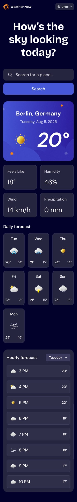
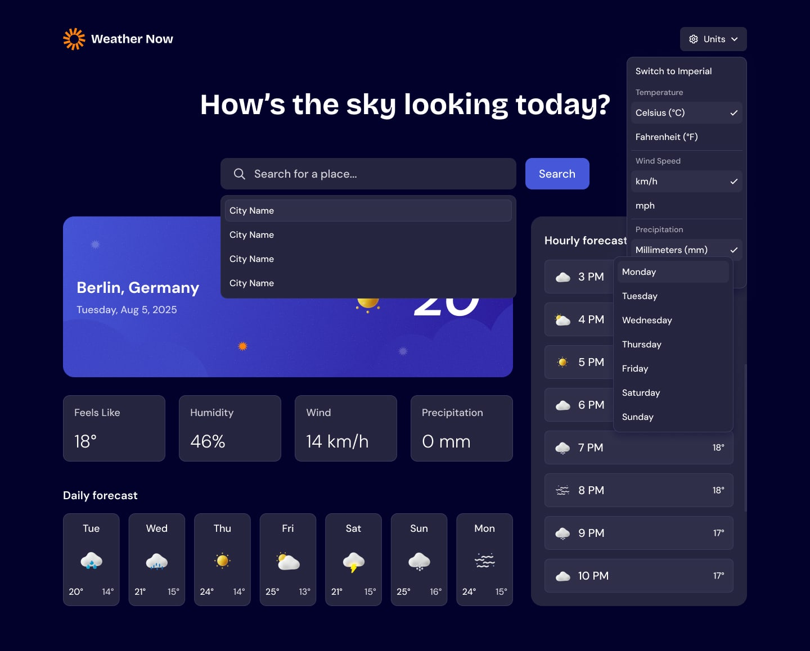
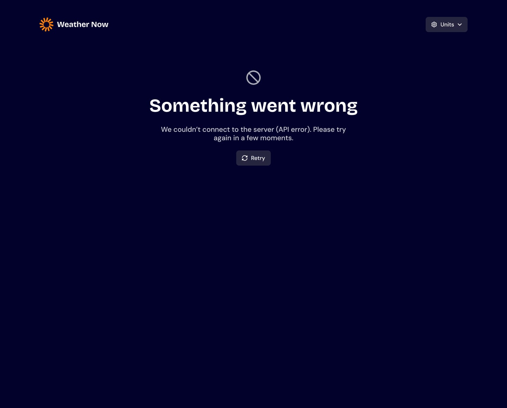
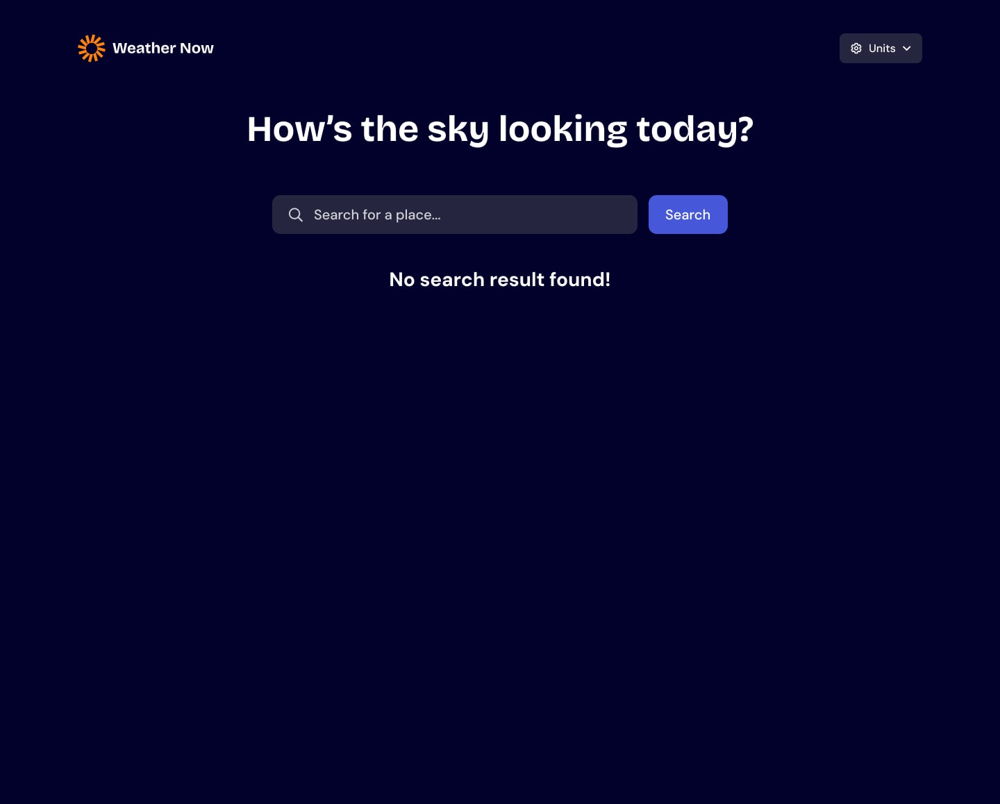

# Weather Now

Aplicacao web moderna para consulta meteorologica global com previsao em tempo real, previsao estendida para 7 dias e detalhamento horario com seletor de dias.


---

## Indice

- [Sobre o Projeto](#sobre-o-projeto)
- [Funcionalidades](#funcionalidades)
- [Tecnologias Utilizadas](#tecnologias-utilizadas)
- [Como Executar o Projeto Localmente](#como-executar-o-projeto-localmente)
- [Execucao da Suite de Testes](#execucao-da-suite-de-testes)
- [Arquitetura do Codigo](#arquitetura-do-codigo)
- [Design e Estados de Interface](#design-e-estados-de-interface)
- [Autor](#autor)

---

## Sobre o Projeto

O Weather Now e uma solucao desenvolvida para o desafio de nivel intermediario do Frontend Mentor. A aplicacao consome dados meteorologicos e de geocodificacao da Open-Meteo API, oferecendo uma experiencia de navegacao fluida, totalmente responsiva e acessivel.

O projeto foi construido com a premissa de utilizar exclusivamente a stack web pura (HTML5, CSS3 e JavaScript nativo), sem a utilizacao de frameworks, bundlers ou pacotes externos de terceiros.

---

## Funcionalidades

- **Pesquisa Inteligente de Localidades**:
  - Busca de cidades via API de geocodificacao da Open-Meteo.
  - Otimizacao com debounce nativo para evitar consumo excessivo de requisicoes de rede.
  - Dropdown com sugestoes de cidades e suporte a navegacao completa por teclado (setas para cima e para baixo, Enter para selecao e Escape para fechar).
  - Feedback visual de busca em andamento e estado amigavel para buscas sem resultado.

- **Painel de Clima Atual**:
  - Nome da cidade e pais com data formatada no padrao local.
  - Temperatura atual e icone representativo das condicoes climaticas (ceu limpo, nublado, chuva, neve, tempestade, etc.).
  - Metricas secundarias detalhadas: Sensacao termica (Feels Like), Umidade relativa do ar (Humidity), Velocidade do vento (Wind) e Precipitacao acumulada (Precipitation).

- **Previsao de 7 Dias**:
  - Exibicao dos proximos dias da semana com dia abreviado, icone climatico e temperaturas maxima e minima de cada dia.

- **Previsao Horaria com Seletor de Dia**:
  - Detalhamento horario em formato de 12 horas (ex: 3 PM, 4 PM).
  - Menu seletor interativo para navegar entre qualquer dia da semana disponivel na previsao.

- **Alternancia de Unidades de Medida**:
  - Alternancia rapida entre o padrao Metrico (Celsius, km/h, mm) e o padrao Imperial (Fahrenheit, mph, in).
  - Permite configurar cada unidade de grandeza individualmente.
  - Recalculo instantaneo na interface para todos os valores em tela sem necessidade de novas requisicoes HTTP.
  - Persistencia automatica das preferencias escolhidas no armazenamento local do navegador (localStorage).

- **Tratamento de Falhas e Resiliencia**:
  - Tela de erro em caso de instabilidade na conexao ou resposta de erro do servidor, equipada com botao de retry para tentativa imediata.

---

## Tecnologias Utilizadas

- **HTML5 Semantico**: Estruturacao com marcos de acessibilidade (header, main, section, aside, footer) e atributos ARIA para conformidade WCAG.
- **CSS3 Puro**: Variaveis CSS (Custom Properties), CSS Grid, Flexbox, estilizacao responsiva para resolucoes mobile (375px) ate desktop (1440px+), alem de estados de foco visivel e animacoes nativas.
- **JavaScript Vanilla (ES Modules)**: Organizacao modular nativa do navegador, sem etapas de compilacao ou transpilacao.
- **Node.js Native Test Runner (`node:test` e `node:assert`)**: Suite de testes automatizados executada diretamente pelo runtime sem nenhuma biblioteca adicional.

---

## Como Executar o Projeto Localmente

### Pre-requisitos

E necessario ter o [Node.js](https://nodejs.org/) instalado na sua maquina (versao 18 ou superior).

### Passo a Passo

1. Clone este repositorio em seu computador:
```bash
git clone https://github.com/menezesjuan/Weather-app.git
cd Weather-app
```

2. Inicie o servidor estatico nativo incluido no projeto (nao requer instalacao de dependencias via npm):
```bash
node server.js
```

3. Abra o seu navegador de preferencia e acesse:
```
http://localhost:3000
```

---

## Execucao da Suite de Testes

O projeto foi concebido seguindo o ciclo de Desenvolvimento Orientado a Testes (TDD). A suite completa abrange testes unitarios de conversoes matematicas, formatacao temporal, mapeamento WMO, cliente de API, gestao de estado e componentes de interface.

### Execucao via Terminal

Para rodar todos os testes automatizados diretamente no terminal, execute:
```bash
node --test tests/*.test.js
```

### Execucao Visual no Navegador

Com o servidor local ativo (`node server.js`), voce tambem pode abrir o executor visual no navegador:
```
http://localhost:3000/tests/runner.html
```

---

## Arquitetura do Codigo

```
weather-app/
├── assets/
│   ├── fonts/               # Fontes DM Sans e Bricolage Grotesque
│   └── images/              # Icones WebP, SVGs e ilustracoes
├── design/                  # Especificacoes e telas do projeto
├── js/
│   ├── api.js               # Comunicacao HTTP com a API Open-Meteo
│   ├── app.js               # Inicializacao e orquestracao dos eventos
│   ├── conversions.js       # Funcoes de conversao de temperatura, vento e chuva
│   ├── formatters.js        # Formatacao de datas, dias da semana e horas
│   ├── state.js             # Store reativa com padrao Pub/Sub e persistencia
│   ├── ui-feedback.js       # Controle das telas de loading, erro e vazio
│   ├── ui-forecast.js       # Renderizacao dos 7 dias e lista horaria
│   ├── ui-search.js         # Input com debounce e lista de cidades
│   ├── ui-units.js          # Menu suspenso de configuracao de unidades
│   └── weather-codes.js     # Mapeamento oficial dos codigos WMO para icones
├── tests/
│   ├── api.test.js          # Testes de integracao do cliente de API
│   ├── conversions.test.js  # Testes de conversoes de grandezas
│   ├── current-weather.test.js # Testes do card principal de clima
│   ├── dom-structure.test.js   # Testes de semantica e tokens CSS
│   ├── feedback-views.test.js  # Testes de alternancia de visualizacoes
│   ├── forecast.test.js     # Testes da previsao de 7 dias e horaria
│   ├── formatters.test.js   # Testes de formatacao de data/hora
│   ├── runner.html          # Test runner visual executavel no navegador
│   ├── sanity.test.js       # Teste de sanidade do ambiente
│   ├── search.test.js       # Testes de busca e navegacao por teclado
│   ├── state.test.js        # Testes da store reativa e local storage
│   ├── units-dropdown.test.js  # Testes do menu e selecao de unidades
│   └── weather-codes.test.js   # Testes de mapeamento dos codigos WMO
├── index.html               # Marcacao HTML semantica principal
├── style.css                # Estilizacao completa e responsiva
├── server.js                # Servidor estatico nativo para desenvolvimento
└── README.md                # Documentacao tecnica do projeto
```

---

## Design e Estados de Interface

### Visualizacao Desktop (Sistema Metrico)


### Visualizacao Mobile (Sistema Metrico)


### Menu de Unidades e Sugestoes de Busca


### Tratamento de Erro de Conexao com Botao de Retry


### Estado de Busca Sem Resultados


---

## Autor

Desenvolvido por **Juan Menezes**.

- GitHub: [https://github.com/menezesjuan](https://github.com/menezesjuan)
- Desafio: [Frontend Mentor - Weather app coding challenge](https://www.frontendmentor.io/challenges/weather-app-K-yc0peOuL)
